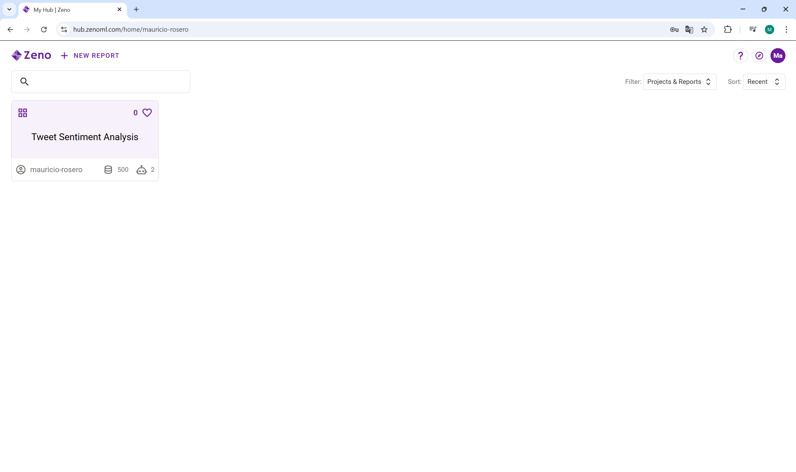
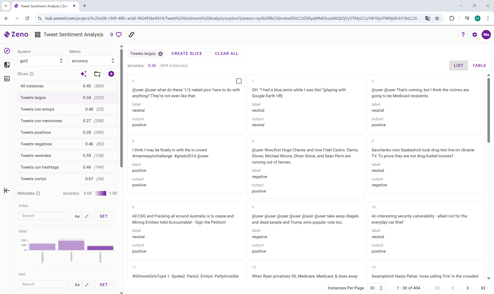

# Lab 4: Model Testing with Zeno and LLM

## Deliverables
- [ ] Successfully start a local Zeno server on the dataset provided, with metrics and model predictions
- [ ] Create 5 slices in the Zeno interface, derive meaningful insights and showcase them to the TA
- [ ] Write down 3 additional slices you want to create and successfully generate 10 examples for one selected slice

